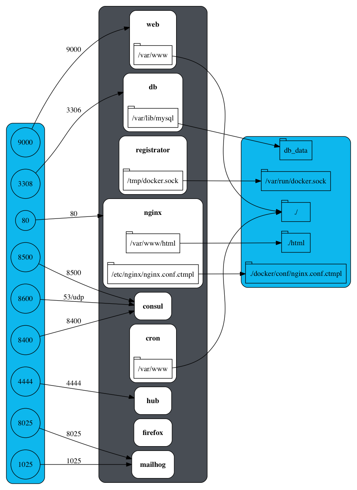

Docker template for Composer + Drupal
=====================================

Provides an optimized, fast, and lightweight local / CI docker environment to
work with Drupal.

## Install + Configuration

### Docker Toolbox

Install [Docker Toolbox][docker-toolbox] which is comprised of the following
tools:

- [Docker Engine][docker-engine]
- [Docker Compose][docker-compose]
- [Docker Machine][docker-machine]
- [Kitematic][kitematic]

It is also highly recommended when using `Docker Machine` you install:

- [Docker Machine NFS][docker-machine-nfs]

> Note: The Docker Toolbox is only one of many methods to get Docker.

### Docker Machine

#### Configure Docker on VirtualBox (Support for proxy bypass)

The use of `$HTTP_PROXY` in this context implies the Host OS has the export.
This is important if you are behind a proxy, else the string will just be NULL
and will be safely ignored.

```sh
  docker-machine create -d virtualbox \
  --engine-env HTTP_PROXY=$HTTP_PROXY \
  --engine-env HTTPS_PROXY=$HTTP_PROXY \
  --engine-env http_proxy=$HTTP_PROXY \
  --engine-env https_proxy=$HTTP_PROXY \
  --engine-storage-driver overlay \
  --virtualbox-cpu-count "4" \
  --virtualbox-memory "12288" \
  site-name
```

> Note: Overlay2 is only supported in OS's with Linux Kernel 4.0+

Create the following in: `/var/lib/boot2docker/bootlocal.sh`

```sh
#!/bin/sh
echo "export HTTP_PROXY=$HTTP_PROXY" >> /home/docker/.ashrc
echo "export HTTPS_PROXY=$HTTP_PROXY" >> /home/docker/.ashrc
echo "export http_proxy=$HTTP_PROXY" >> /home/docker/.ashrc
echo "export https_proxy=$HTTP_PROXY" >> /home/docker/.ashrc
```

Switch between multiple Docker Machines with the following command:

```sh
eval $(docker-machine env site-name)
```

#### Configure Docker Machine with high speed NFS mounts.

The following command activates NFS for an existing boot2docker box created
through Docker Machine:

```sh
docker-machine-nfs site-name
```

#### Build + Start Docker Machine

All of the Docker containers rely on a composer build. Since this is a first
run this command will be executed first. The next command is to build the base
container for this project from which all dependent containers will derive.
Finally the whole infrastructure is instantiate with `docker-compose`.

```sh
composer update
docker-compose build --no-cache
docker-compose up -d
```

> Note: The second step can easily be replaced by a Docker Hub image that is
continuously rebuilt with CI.

## Architecture

Now that all of the infrastructure and pre-requisites have now been installed +
built out we can take a moment to go over the architecture.

The tree diagram represented below gives a overview of the generated scaffold.
All logic is contained within a single docker folder + 5 controller files.

```
.
├── docker (folder)
│   ├── bin
│   │   ├── activate
│   │   ├── behat
│   │   ├── composer
│   │   ├── drupal
│   │   ├── drush
│   │   ├── lint
│   │   ├── php
│   │   ├── phpcs
│   │   ├── phpmd
│   │   ├── phpunit
│   │   └── simpletest
│   ├── conf
│   │   ├── console
│   │   ├── drupal
│   │   ├── nginx.conf.ctmpl
│   │   ├── phpcs.xml
│   │   └── phpunit.xml
│   ├── images
│   │   │── 1.0-alpha1
│   │   │   ├── scripts
│   │   │   │   └── ScriptHandler.php
│   │   │   └── Dockerfile
│   │   ├── ci
│   │   │   ├── Dockerfile
│   │   │   └── php.ini
│   │   ├── cron
│   │   │   ├── Dockerfile
│   │   │   └── tasks
│   │   │       ├── monthly
│   │   │       ├── hourly
│   │   │       ├── daily
│   │   │       └── 15min
│   │   │           └── test
│   │   └── dev
│   │       ├── Dockerfile
│   │       └── php.ini
│   ├── scripts
│   │   └── ScriptHandler.php
│   ├── config.yml
│   ├── deploy.php
│   └── Dockerfile
├── .gitlab-ci.yml        (controller file for CI)
├── .travis.yml           (controller file for CI)
├── docker-compose.yml    (controller file for Docker)
├── docker-compose-ci.yml (controller file for Docker)
└── Makefile              (controller file for Docker)
```

> Note: The `composer.json` + `scripts/scriptHandler.php` file will be copied
from the project into the `docker` + `docker/images/<release>` folder.

Overall the bulk of the logic for how the `drupal-scaffold-docker` plugin works
can be gathered from the the `downloadScaffold()` function in the `Handler.php`
file.

- [downloadScaffold()][docker-drupal-scaffold-down]

All the `downloadScaffold()` does is iterate over all of the template
(a.k.a skeleton) files performing token replacement while downloading the
scaffold. The following tokens are given below:

### Tokens

`{{__ORG__}}`

Replaced by the organization name given in a project's root `composer.json`
file name property.

`{{__PROFILE__}}`

Replaced by the detected installation profile name. This supports detecting the
base installation profile through dependency resolving (`depResolve()`) and
iterating over the `type:drupal-profile` composer configuration property.

`{{__REPO__}}`

Replaced by the repository name given in a project's root `composer.json`
file `name` property.

`{{__REPO_SHORT__}}`

Replaced by the repository name given in a project's root `composer.json`
file `name` property and passed through a custom regex `[^A-Za-z0-9]` filter.

### Bin folder `docker/bin`

You can interact with Drupal and associated tools via the `docker/bin` commands.

```
.
├── activate
├── behat
├── cli
├── composer
├── drupal
├── drush
├── lint
├── php
├── phpcs
├── phpmd
├── phpunit
└── simpletest
```

> Note: The `docker/bin` folder provides idempotent control over a range of
docker services as they are wrappers to `docker run`.

The following are some example(s) of commonly used commands to help illustrate
how they can be leveraged:

Call any `drush` command:

```sh
./docker/bin/drush archive-dump --destination="drupal$$(date +%Y%m%d_%H%M%S).tgz"
```

Lint all of the Docker files:

```sh
./docker/bin/lint
```

Run `PHPCS` + `PHPUnit`:

```sh
./docker/bin/phpcs --standard=/var/www/html/core/phpcs.xml

./docker/bin/phpunit --colors=always \
                     --testsuite=kernel \
                     --group drupal
```

### Makefile

The makefile corresponding to this project provides a wide array of useful
operations in order to interact with your Drupal site. For instance to install
your composer based Drupal project:

```sh
make drupal_install
```

You can get a full list of Makefile targets by typing:

```sh
make list
```

## Docker Images

Every image (except for MySQL) is based on the lightweight [Alpine][alpine]
Linux distribution. Additionally most of the images listed below are extended
off of each other to take advantage of docker layering best practices. Due to
this you will be downloading far less then the listed amounts. Finally every
image in some form or another is directly derived from Docker official images.

> Note: There are additional tricks such as leveraging a
[docker registry proxy][docker-registry] cache so on rebuilds, you won't need
to download the images when rebuilding etc.

### Images (Official)

| Repository                      | Tag          | Size      |
| ------------------------------- | ------------ | --------- |
| alpine                          | latest       | 3.98  MB  |
| gliderlabs/registrator          | latest       | 23.76 MB  |
| consul                          | latest       | 38.75 MB  |
| mailhog/mailhog                 | latest       | 46.56 MB  |
| mysql                           | 5.6          | 327.5 MB  |

##### Alpine

[Alpine][alpine] is the base layer that all of our images leverage. Chosen for
its small size, resource isolation, and memory efficiency. Additionally
[Alpine][alpine] provides a great packager to help with docker layering namely
[apk][apk].

#### Registrator

[Registrator][registrator] automatically registers and deregisters services for
any Docker container by inspecting containers as they come online.
[Registrator][registrator] is configured to automatically populate
[Consul][consul].

#### Consul

[Consul][consul] makes it simple for services to register themselves and to
discover other  services via a DNS or HTTP interface. [Consul][consul] provides
a flexible key/value store enables storing dynamic configuration, feature
flagging, coordination, leader election and more.

#### Mailhog

[Mailhog][mailhog] is an incredibly light weight email testing tool for
developers build in [go][go]. You can configure the application for SMTP
delivery, view messages in the web UI, or retrieve them with the JSON api.

#### MySQL

The only non alpine image is the MySQL image. Currently it is being worked to
create an [Alpine][alpine] variant much like the PostgreSQL image.

### Helper Images (Extended)

| Repository                      | Tag          | Size      |
| ------------------------------- | ------------ | --------- |
| drupalwxt/nginx-consul-template | latest       | 74.82 MB  |
| drupalwxt/selenium              | hub          | 155.4 MB  |
| drupalwxt/selenium              | node-firefox | 326.5 MB  |

#### Nginx + Consul Template

Creates a configurable load balancer through [Consul][consul]'s key / value
store which dynamically populates `Nginx` with the different Docker
environments. Can be interacted with via simple curl requests.

- [drupalwxt/nginx-consul-template][nginx-consul-template]

#### Selenium (Hub + Node Firefox)

A bare bones selenium environment built in [Alpine][alpine]. Contains both the
[Selenium Grid Hub][selenium-grid] and [Selenium Node][selenium-node] images
configured to run firefox.

- [drupalwxt/selenium][selenium]

### Drupal Images (Local)

| Repository                      | Tag          | Size      |
| ------------------------------- | ------------ | --------- |
| drupalwxt/drupal                | latest       | 190.2 MB  |
| org/site-name                   | latest       | 523.7 MB  |
| sitename_cron                   | latest       | 523.7 MB  |
| sitename_web                    | latest       | 650.6 MB  |

#### Base Drupal Layer (drupalwxt/drupal)

Eventually this image should be ported to the Docker official library for
Drupal. Currently the official Drupal image doesn't support the [Alpine][alpine]
variant. As most other popular projects have an [Alpine][alpine] variant this
will eventually be accepted. Right now this image directly extends off of
`php:7.0-fpm-alpine`.

- [drupalwxt/drupal][docker-drupal]

#### Drupal Site Layer (org/site-name)

This image when built or pulled from Docker Hub (if desired) is a direct
extension of the base Drupal layer. It simply calls the base layer and runs the
following composer command (amongst others) in the container:

```
composer global require "hirak/prestissimo:^0.3" && \
composer install --prefer-dist \
                 --no-interaction \
                 --no-dev
```

> Note: This layer doesn't include the dev dependencies from composer.json

- [Dockerfile][drupal-site-layer]

#### Drupal Cron Layer (sitename_cron)

This container when built is directly extended off of the Drupal Site Layer
with the only concern of carrying out cron tasks.

- [Dockerfile][drupal-site-cron-layer]

#### Drupal Site Development Layer (sitename_web)

This image when built or pulled from the `Docker Hub` (if present) is a direct
extension of the `Drupal Site layer` with the added composer dev dependencies
and `XDebug` as well as a few other important developer tooling.

```
composer install --prefer-dist --no-interaction
```

- [Dockerfile][drupal-site-dev-layer]

#### Drupal Site CI Layer (sitename_web_scripts)

This image when built or pulled from the `Docker Hub` (if present) is a direct
extension of the `Drupal Site layer` with only the added composer dev
dependencies.

```
composer install --prefer-dist --no-interaction
```

- [Dockerfile][drupal-site-ci-layer]

### Implementations

Currently there are two public GitHub projects using this Docker workflow as
well as a few private ones:

> Note: see the respective `docker` folder and `docker-compose.yml` file):

- [site-wxt][site-wxt]
- [site-open-data][site-open-data]

Tests can be accessed via Travis CI and are simply leveraging docker-compose to
instantiate the infrastructure.

- [site-wxt][travisci-site-wxt]
- [site-open-data][travisci-site-open-data]

The specific default templates for both Gitlab CI / Travis CI can be found here:

- [.gitlab-ci.yml][ci-gitlab-ci]
- [.travis-ci.yml][ci-travis-ci]

## Diagram

Below is a `graphviz` dot representation of our `docker-compose.yml` file.



## Acknowledgements

Where possible we try to follow the best practices laid out by the top-tier
Drupal projects namely:

* [Lightning][lightning] distribution created by [Acquia][acquia]
* [Open Social][open_social] distribution created by [Goal Gorilla][goalgorilla]

## Tips and Tricks

If you are switching between a lot of projects and / or need to do full
container rebuilds a lot. A great time / bandwidth saver is by setting up a
Docker registry proxy cache. What this does is allow for every docker image
pulled to be transparently saved locally for subsequent docker pulls.

- [Documentation][docker-registry]
- [Repository][docker-registry-proxy-cache]

[acquia]:                       https://acquia.com
[alpine]:                       https://alpinelinux.org
[apk]:                          http://wiki.alpinelinux.org/wiki/Alpine_Linux_package_management
[ci-gitlab-ci]:                 .gitlab-ci.yml
[ci-travis-ci]:                 .travis.yml
[console]:                      https://drupalconsole.com
[consul]:                       https://www.consul.io
[docker-compose]:               https://www.docker.com/products/docker-compose
[docker-engine]:                https://www.docker.com/products/docker-engine
[docker-machine]:               https://www.docker.com/products/docker-machine
[docker-machine-nfs]:           https://github.com/adlogix/docker-machine-nfs
[docker-toolbox]:               https://www.docker.com/products/docker-toolbox
[docker-drupal]:                https://github.com/drupalwxt/drupal
[docker-drupal-scaffold]:       https://github.com/drupalwxt/drupal-scaffold-docker
[docker-drupal-scaffold-down]:  https://github.com/drupalwxt/drupal-scaffold-docker/blob/master/src/Handler.php#L104
[docker-registry]:              https://docs.docker.com/registry/recipes/mirror
[docker-registry-proxy-cache]:  https://github.com/drupalwxt/registry-proxy-cache
[drupal-site-layer]:            docker/Dockerfile
[drupal-site-ci-layer]:         docker/images/ci/Dockerfile
[drupal-site-cron-layer]:       docker/images/cron/Dockerfile
[drupal-site-dev-layer]:        docker/images/dev/Dockerfile
[go]:                           https://golang.org
[goalgorilla]:                  https://www.goalgorilla.com/en
[lightning]:                    https://github.com/acquia/lightning
[kitematic]:                    https://www.docker.com/products/docker-kitematic
[mailhog]:                      https://github.com/mailhog/MailHog
[nginx-consul-template]:        https://github.com/drupalwxt/nginx-consul-template
[open_social]:                  https://www.drupal.org/project/social
[panopoly]:                     https://github.com/panopoly/panopoly
[registrator]:                  https://github.com/gliderlabs/registrator
[selenium]:                     https://github.com/drupalwxt/selenium
[selenium-grid]:                http://www.seleniumhq.org/projects/grid
[selenium-node]:                https://github.com/SeleniumHQ/selenium
[site-open-data]:               https://github.com/open-data/site-open-data
[site-wxt]:                     https://github.com/drupalwxt/site-wxt
[travisci-site-open-data]:      https://travis-ci.org/open-data/site-open-data
[travisci-site-wxt]:            https://travis-ci.org/drupalwxt/site-wxt
